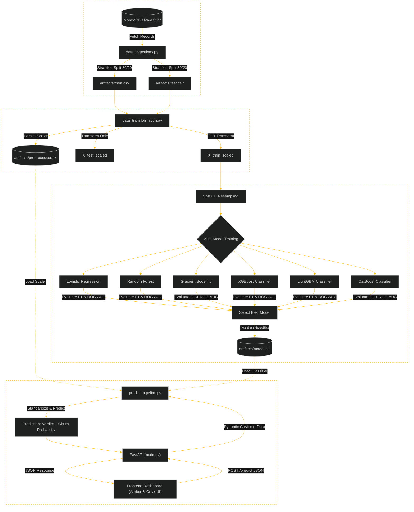

# 📊 Customer Churn Predictor — End-to-End Machine Learning System

An enterprise-grade, end-to-end Machine Learning web application designed to predict customer churn probability in the telecommunications sector. Built with **FastAPI**, **Scikit-Learn / XGBoost / CatBoost**, and an interactive **Amber & Onyx high-contrast frontend**.

---

## 📑 Table of Contents
- [Overview](#-overview)
- [Key Features](#-key-features)
- [System Architecture](#-system-architecture)
- [Feature Telemetry Dictionary](#-feature-telemetry-dictionary)
- [Tech Stack](#-tech-stack)
- [Project Directory Structure](#-project-directory-structure)
- [Installation & Setup](#-installation--setup)
- [Model Training & Pipelines](#-model-training--pipelines)
- [Running the Application](#-running-the-application)
- [API Reference](#-api-reference)
- [Frontend Experience & Rule-Based Risk Indicators](#-frontend-experience--rule-based-risk-indicators)

---

## 🌟 Overview

Customer attrition (churn) directly impacts subscription recurring revenues. This project provides:
1. **Automated ML Pipelines**: Complete lifecycle from data ingestion (MongoDB/CSV), data transformation with preprocessing scalers, and multi-model training/evaluation.
2. **High-Performance Inference**: FastAPI REST backend exposing real-time prediction and probability scoring endpoints.
3. **Interactive UI**: Sleek frontend designed with a high-impact **Amber (`#FFBE0B`) & Onyx Black (`#101010`)** aesthetic, real-time probability progress animations, sample profile presets, and risk assessment insights.

---

## ✨ Key Features

- **End-to-End Pipeline**: Modular architecture separating Ingestion, Transformation, Model Training, and Prediction.
- **Ensemble ML Support**: Evaluates multiple algorithms including **CatBoost**, **XGBoost**, **LightGBM**, and **Random Forest**.
- **Real-Time Probability Estimation**: Computes both class verdict (`Churn` / `No Churn`) and calibrated probability percentages.
- **Interactive Preset Simulator**: Load pre-configured customer profiles (*Loyal Customer*, *Standard User*, *High Churn Risk*) with one click.
- **Dynamic Heuristic Insights**: Automatically highlights key churn risk drivers (excess customer support friction, unrenewed contracts, overage bill shock).
- **Embedded API Inspector**: Live view of outgoing JSON request payloads and incoming backend responses.

---

## 🏗 System Architecture & End-to-End Workflow

The system is architected as a modular, decoupled Machine Learning lifecycle comprising **7 core subsystems**:



---

### 🔍 Layer-by-Layer Architectural Breakdown

#### 1. Data Storage & Ingestion Subsystem (`src/database/` & `src/components/data_ingestions.py`)
- **Persistence**: MongoDB Atlas (`customer_churn` database, `customers` collection) accessed via `PyMongo` with environment-managed credentials (`.env`).
- **Ingestion**: `initiate_data_ingestion()` fetches document collections without MongoDB `_id` fields, loads them into pandas DataFrames, and performs **Stratified Train/Test Splitting** (`80% Train / 20% Test`, `random_state=42`) preserving class ratios on the target label (`Churn`).
- **Artifacts Created**: Serializes `artifacts/train.csv` and `artifacts/test.csv`.

#### 2. Feature Transformation Subsystem (`src/components/data_transformation.py`)
- **Isolation of Preprocessing**: Strict separation of fit and transform steps to eliminate data leakage.
- **Pipeline Structure**: Employs Scikit-Learn `ColumnTransformer` with `StandardScaler` applied across all numerical telemetry columns (`AccountWeeks`, `DataUsage`, `DayMins`, `MonthlyCharge`, `OverageFee`, etc.).
- **Artifacts Created**: Serializes fitted transformer to `artifacts/preprocessor.pkl`.

#### 3. Imbalanced Learning & Model Benchmarking (`src/components/model_trainer.py`)
- **Class Imbalance Remediation**: Training features undergo **SMOTE** (Synthetic Minority Over-sampling Technique) to synthesize minority churn samples, while validation remains strictly on un-resampled test data.
- **Ensemble Benchmarking**: Trains and evaluates 6 distinct algorithms concurrently:
  1. *Logistic Regression* (baseline linear model)
  2. *Random Forest Classifier* (`n_estimators=200`)
  3. *Gradient Boosting Classifier* (`random_state=42`)
  4. *XGBoost Classifier* (`n_estimators=200`, `learning_rate=0.05`, `max_depth=5`)
  5. *LightGBM Classifier* (`n_estimators=200`, `learning_rate=0.05`, `max_depth=5`)
  6. *CatBoost Classifier* (`iterations=200`, `learning_rate=0.05`, `depth=5`)
- **Selection Metric**: Automatically selects and persists the best performing model based on **F1-Score** and **ROC-AUC** to `artifacts/model.pkl`.

#### 4. Real-Time Inference Subsystem (`src/pipeline/predict_pipeline.py`)
- **Single-Pass Inference**: Loads `artifacts/model.pkl` and `artifacts/preprocessor.pkl` into memory upon application startup.
- **Feature Standardizer**: Converts incoming JSON payload into single-row pandas DataFrame, scales using the serialized preprocessor, and generates both class predictions (`0` or `1`) and confidence probabilities (`model.predict_proba()[:, 1]`).

#### 5. Application & Serving Layer (`main.py`)
- **Framework**: High-speed asynchronous [FastAPI](https://fastapi.tiangolo.com/) web server mounted with Uvicorn ASGI.
- **Data Validation**: Strict Pydantic model (`CustomerData`) enforcing data types and constraints on all 10 features.
- **Static Asset Serving**: Mounts `/static` directory for CSS/JS and maps root `GET /` to `templates/index.html`.

#### 6. Presentation & Client Layer (`templates/` & `static/`)
- **Design System**: High-contrast **Vibrant Amber (`#FFBE0B`) & Onyx Black (`#101010`)** aesthetic with geometric typography (*Outfit* & *JetBrains Mono*).
- **Rule-Based Risk Indicators**: Client-side evaluator flagging high support calls ($\ge 4$), unrenewed contracts, overage bill spikes ($> \$15$), and tenure loyalty factors.
- **Interactive Preset Engine**: Instant telemetry autofill for *Loyal Customer*, *Standard User* (~50% decision boundary), and *High Churn Risk* profiles.

#### 7. Cross-Cutting Infrastructure (`src/logger.py` & `src/exception.py`)
- **Centralized Logging**: Auto-generates timestamped runtime execution logs under `logs/`.
- **Custom Exception Handling**: Intercepts traceback metadata capturing script filenames, exact execution line numbers, and detailed error messages.

---

## 📋 Feature Telemetry Dictionary

The model accepts 10 core telemetry variables:

| Feature Name | Type | Description | Example Range |
| :--- | :---: | :--- | :---: |
| `AccountWeeks` | `int` | Duration in weeks customer has held an active account | `1 - 500` |
| `ContractRenewal`| `int` | Whether customer renewed contract recently (`1` = Yes, `0` = No) | `0` or `1` |
| `DataPlan` | `int` | Cellular data subscription status (`1` = Active, `0` = None) | `0` or `1` |
| `DataUsage` | `float` | Monthly cellular data traffic consumed in Gigabytes (GB) | `0.0 - 50.0` |
| `CustServCalls` | `int` | Number of calls placed to customer support | `0 - 25` |
| `DayMins` | `float` | Average daytime voice call minutes per month | `0.0 - 800.0` |
| `DayCalls` | `int` | Total count of daytime voice calls made | `0 - 300` |
| `MonthlyCharge` | `float` | Base average monthly bill in USD ($) | `$10.0 - $300.0` |
| `OverageFee` | `float` | Peak overage fee charged in last 12 months in USD ($) | `$0.0 - $100.0` |
| `RoamMins` | `float` | Average monthly roaming minutes outside home network | `0.0 - 100.0` |

---

## 🛠 Tech Stack

- **Backend**: Python 3.10+, [FastAPI](https://fastapi.tiangolo.com/), [Uvicorn](https://www.uvicorn.org/), Pydantic
- **Machine Learning**: [Scikit-Learn](https://scikit-learn.org/), [XGBoost](https://xgboost.readthedocs.io/), [CatBoost](https://catboost.ai/), [LightGBM](https://lightgbm.readthedocs.io/), Joblib, Pandas, NumPy
- **Frontend**: HTML5, Vanilla CSS3 (Custom Design System), JavaScript (ES6+ Fetch API), Google Fonts (*Outfit* & *JetBrains Mono*)
- **Database / Data Source**: MongoDB ([PyMongo](https://pymongo.readthedocs.io/)) / CSV storage

---

## 📂 Project Directory Structure

```
├── artifacts/                  # Serialized artifacts (model.pkl, preprocessor.pkl, raw data)
│   ├── model.pkl
│   ├── preprocessor.pkl
│   ├── raw.csv
│   ├── test.csv
│   └── train.csv
├── logs/                       # Application and training log files
├── notebooks/                  # EDA and experimentation Jupyter notebooks
├── src/                        # Core application package
│   ├── components/             # Pipeline components
│   │   ├── data_ingestions.py
│   │   ├── data_transformation.py
│   │   └── model_trainer.py
│   ├── database/               # Database connection utilities
│   ├── pipeline/               # Execution pipelines
│   │   ├── predict_pipeline.py
│   │   └── train_pipeline.py
│   ├── exception.py            # Custom exception handling
│   ├── logger.py               # Centralized logging configuration
│   └── utils.py                # Helper functions (save/load objects)
├── static/                     # Frontend static assets
│   ├── script.js               # Frontend controller & API integration
│   └── style.css               # Amber & Onyx design system stylesheet
├── templates/                  # Frontend HTML templates
│   └── index.html              # Main dashboard view
├── .env                        # Environment variables (MongoDB URI, etc.)
├── main.py                     # FastAPI entry point & route definitions
├── pyproject.toml              # Build configuration
├── requirements.txt            # Python dependencies
└── README.md                   # Project documentation
```

---

## 🚀 Installation & Setup

### 1. Clone Repository
```bash
git clone https://github.com/your-username/Customer-Churn.git
cd Customer-Churn
```

### 2. Create and Activate a Virtual Environment
```bash
# Windows
python -m venv .venv
.venv\Scripts\activate

# macOS / Linux
python3 -m venv .venv
source .venv/bin/activate
```

### 3. Install Dependencies
```bash
pip install -r requirements.txt
```

---

## 🔄 Model Training & Pipelines

To execute data ingestion, preprocessing, and model training from scratch:

```bash
# Run training pipeline
python -m src.pipeline.train_pipeline
```

Upon completion, updated artifacts (`model.pkl` and `preprocessor.pkl`) will be saved in the `artifacts/` folder.

---

## 🌐 Running the Application

Start the FastAPI server with Uvicorn:

```bash
# Start server with auto-reload
uvicorn main:app --host 127.0.0.1 --port 8000 --reload
```

Once started:
- 🖥️ **Web Dashboard**: Open [http://127.0.0.1:8000](http://127.0.0.1:8000) in your browser.
- 📖 **Interactive API Documentation (Swagger UI)**: [http://127.0.0.1:8000/docs](http://127.0.0.1:8000/docs)
- 📑 **ReDoc Documentation**: [http://127.0.0.1:8000/redoc](http://127.0.0.1:8000/redoc)

---

## 🔌 API Reference

### 1. Root / UI Route
- **URL**: `/`
- **Method**: `GET`
- **Description**: Serves the frontend web dashboard (`templates/index.html`).

---

### 2. Churn Prediction Route
- **URL**: `/predict`
- **Method**: `POST`
- **Headers**: `Content-Type: application/json`

#### Request Body Example:
```json
{
  "AccountWeeks": 38,
  "ContractRenewal": 0,
  "DataPlan": 0,
  "DataUsage": 0.0,
  "CustServCalls": 5,
  "DayMins": 295.4,
  "DayCalls": 130,
  "MonthlyCharge": 89.50,
  "OverageFee": 19.80,
  "RoamMins": 15.6
}
```

#### Successful Response (`200 OK`):
```json
{
  "prediction": "Churn",
  "churn_probability": 0.9716
}
```

---

## 🎯 Frontend Experience & Rule-Based Risk Indicators

The frontend UI evaluates key customer risk indicators in real-time alongside model output:
- 🚨 **High Support Activity**: Flags customers exceeding 3+ support calls signaling potential friction.
- ⚠️ **Unrenewed Contract**: Highlights increased flight risk when contracts lapse without renewal.
- 💸 **Overage Surcharges**: Identifies potential bill shock when peak overage fees exceed thresholds.
- 🟢 **Account Tenure**: Identifies high-loyalty accounts with long tenure.

---

## 📜 License
This project is licensed under the MIT License.
